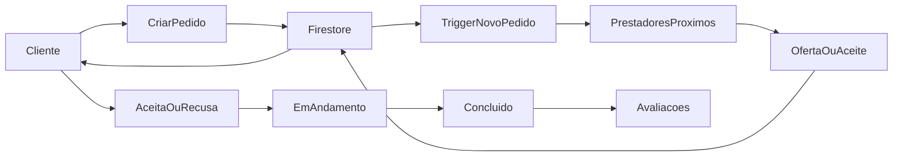

# Arquitetura inicial do FastFix

## Visão geral

A arquitetura prioriza velocidade de entrega do MVP e operação em tempo real:

- **Cliente mobile** em Flutter/FlutterFlow.
- **Firebase Auth** para login por SMS.
- **Cloud Firestore** para dados transacionais e sincronização em tempo real.
- **Firebase Storage** para fotos e evidências.
- **Cloud Functions** para regras de orquestração e automações sensíveis.
- **FCM** para notificações de novos pedidos, ofertas e atualizações de status.

## Fluxo principal

## Modelo de dados resumido

### users

- `displayName`
- `phoneNumber`
- `roles`
- `ratingAverage`
- `ratingCount`
- `completedServices`
- `serviceCategories`
- `location.lat`
- `location.lng`
- `location.geohash`
- `isActive`
- `createdAt`
- `updatedAt`

### requests

- `clientId`
- `serviceType`
- `questionsAnswers`
- `description`
- `photoUrls`
- `urgencyLevel`
- `suggestedPrice`
- `complexityLevel`
- `location`
- `status`
- `expiresAt`
- `acceptedProviderId`
- `finalPrice`
- `createdAt`
- `updatedAt`

### requests/{requestId}/offers

- `providerId`
- `priceOffered`
- `messageTemplate`
- `status`
- `createdAt`
- `updatedAt`

### ratings

- `requestId`
- `raterId`
- `rateeId`
- `score`
- `comment`
- `createdAt`

### disputes

- `requestId`
- `openedBy`
- `againstUserId`
- `reason`
- `evidenceUrls`
- `status`
- `resolutionNotes`
- `createdAt`
- `updatedAt`

## Regras de domínio do MVP

1. Somente usuários autenticados podem acessar dados.
2. O cliente só cria e atualiza pedidos próprios.
3. Prestadores apenas criam ofertas em pedidos publicados.
4. Apenas o cliente dono do pedido pode aceitar uma oferta.
5. Avaliações só podem ser criadas por participantes do pedido concluído.
6. Disputas exigem vínculo com um pedido existente.

## Roadmap técnico sugerido

### Fase 1

- Auth por telefone
- perfil de usuário
- criação e listagem de pedidos
- aceite simples
- atualização de status

### Fase 2

- contra-oferta estruturada
- notificações push
- expiração automática
- avaliações

### Fase 3

- disputa
- split de pagamentos
- ranking de visibilidade
- analytics operacional
